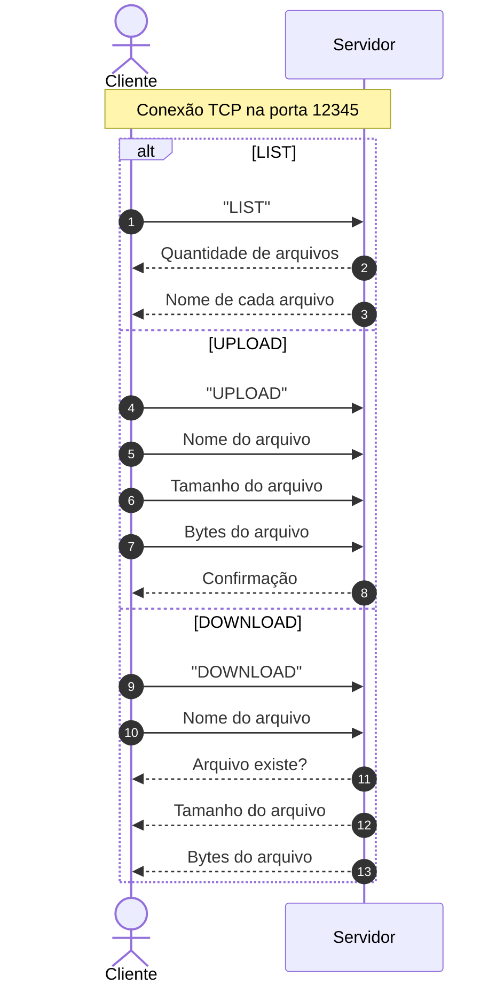

# 📂 SiCA — Sistema de Compartilhamento de Arquivos em Java

> Projeto acadêmico desenvolvido para praticar conceitos de comunicação em rede utilizando Java e Sockets TCP.

O **SiCA** é uma aplicação cliente-servidor desenvolvida em **Java** que permite listar, enviar e baixar arquivos entre um cliente e um servidor utilizando comunicação via **TCP**.

O projeto foi desenvolvido com foco no aprendizado de conceitos de redes, sockets, entrada e saída de dados e manipulação de arquivos.

---

## 🚀 Funcionalidades

* [x] **LIST** — lista os arquivos disponíveis no servidor.
* [x] **UPLOAD** — envia arquivos do cliente para o servidor.
* [x] **DOWNLOAD** — baixa arquivos armazenados no servidor.
* [x] **Comunicação via TCP** utilizando IP e porta.
* [x] **Transferência de arquivos em blocos de bytes**.

---

## 🛠️ Tecnologias utilizadas

* **Java**
* **TCP**
* **Java Sockets**
* `java.net.ServerSocket`
* `java.net.Socket`
* `java.io.DataInputStream`
* `java.io.DataOutputStream`
* `java.io.FileInputStream`
* `java.io.FileOutputStream`

---

## 📊 Arquitetura e protocolo de comunicação

O SiCA utiliza uma arquitetura cliente-servidor.

O servidor fica aguardando conexões na porta `12345`, enquanto o cliente se conecta ao endereço configurado no código.

Atualmente, o cliente utiliza:

```text id="4c8jz7"
127.0.0.1:12345
```

Ou seja, cliente e servidor são executados, por padrão, na mesma máquina.



---

## 📁 Estrutura do projeto

```text id="c6zyry"
Trabalho/
│
├── src/
│   ├── Cliente.java
│   └── Servidor.java
│
├── bin/
│   ├── Cliente.class
│   └── Servidor.class
│
├── servidor_arquivos/
│   ├── Teste.txt
│   └── Teste1.txt
│
└── README.md
```

A pasta `servidor_arquivos` é utilizada pelo servidor para armazenar os arquivos disponíveis.

A pasta `cliente_arquivos` é criada automaticamente quando o cliente é executado e é utilizada para armazenar arquivos locais e downloads realizados.

---

## 📤 Como funciona o UPLOAD

No upload, o cliente envia primeiro informações sobre o arquivo:

```text id="oc3b8l"
UPLOAD
Nome do arquivo
Tamanho do arquivo
```

Depois, o conteúdo do arquivo é enviado em blocos de bytes.

O servidor recebe os dados e salva o arquivo na pasta `servidor_arquivos`.

---

## 📥 Como funciona o DOWNLOAD

No download, o cliente informa ao servidor qual arquivo deseja baixar.

O servidor verifica se o arquivo existe e responde com essa informação.

Caso exista, o servidor envia:

```text id="mqbkha"
Tamanho do arquivo
Bytes do arquivo
```

O cliente recebe os dados e salva o arquivo na pasta `cliente_arquivos`.

---

## 📃 Como funciona o LIST

O cliente envia o comando:

```text id="o0630r"
LIST
```

O servidor consulta os arquivos disponíveis em `servidor_arquivos` e envia primeiro a quantidade encontrada.

Em seguida, envia o nome de cada arquivo para o cliente.

Exemplo:

```text id="b8xhdz"
2
Teste.txt
Teste1.txt
```

---

## 📦 Transferência em blocos

Os arquivos não são carregados completamente na memória antes da transferência.

O projeto utiliza um buffer:

```java id="3ybo8l"
byte[] buffer = new byte[4096];
```

Isso permite que o arquivo seja enviado em blocos de até **4096 bytes**, aproximadamente **4 KiB**, por vez.

O processo acontece de forma semelhante a:

```text id="opavvx"
Arquivo
  ↓
FileInputStream
  ↓
Buffer de bytes
  ↓
Socket
  ↓
FileOutputStream
  ↓
Novo arquivo
```

---

## 🧠 Conceitos praticados

Durante o desenvolvimento do projeto foram utilizados conceitos como:

* arquitetura cliente-servidor;
* comunicação via TCP;
* `Socket` e `ServerSocket`;
* entrada e saída de dados;
* leitura e escrita de arquivos;
* transferência de arquivos em bytes;
* criação de um protocolo simples de comandos;
* tratamento de exceções;
* uso de `try-with-resources`.

Um dos pontos importantes é que cliente e servidor precisam seguir a mesma ordem durante a comunicação.

Por exemplo, se o cliente envia:

```java id="ej8qtv"
out.writeUTF("DOWNLOAD");
out.writeUTF(nomeArquivo);
```

o servidor precisa receber os dados na mesma sequência:

```java id="rwdjt6"
String comando = in.readUTF();
String nomeArquivo = in.readUTF();
```

---

## 🎓 Contexto acadêmico

O SiCA foi desenvolvido como projeto acadêmico com o objetivo de aplicar na prática conceitos de comunicação cliente-servidor, redes, sockets e transferência de arquivos utilizando Java.
